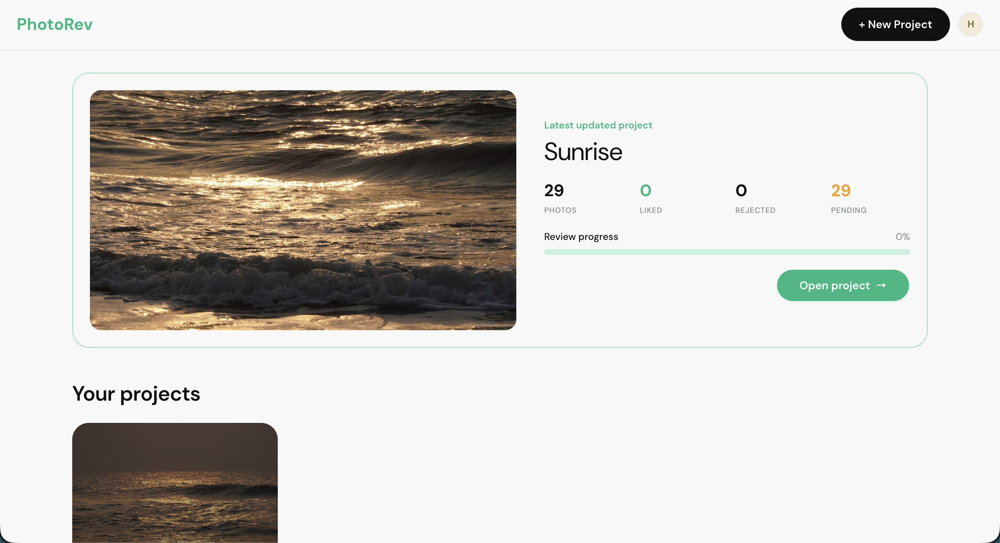
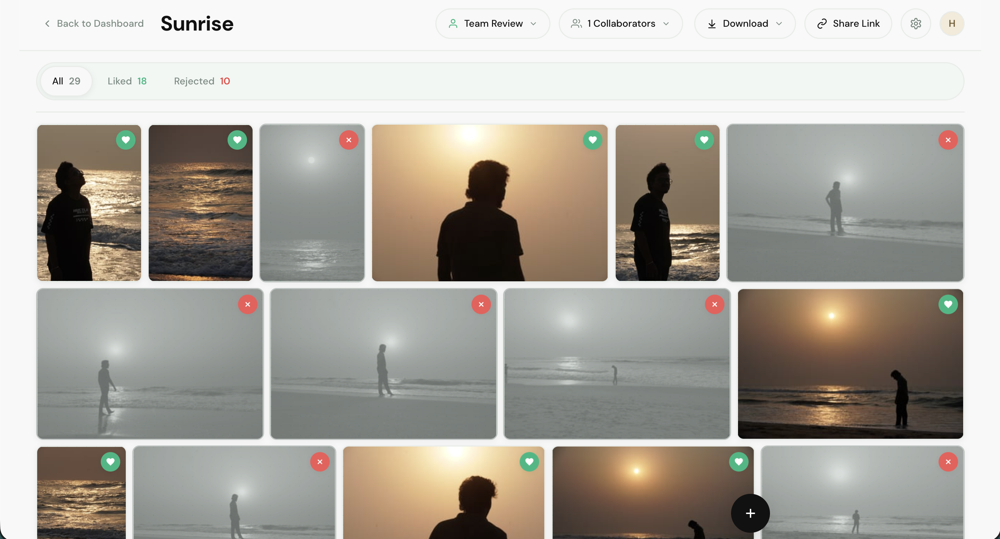

# photorev

Speed up photo review workflows after events.

## UI Screenshots

### Dashboard



*Home screen with your latest project, photo counts, and review progress at a glance.*

### Project review



*Inside a project: filter by status, collaborate with your team, and mark favorites or rejects on the grid.*

## Prerequisites

| Tool | Version |
|------|---------|
| [Node.js](https://nodejs.org/) | 20+ (22 recommended) |
| [pnpm](https://pnpm.io/) | 10.x (`corepack enable`) |
| [PostgreSQL](https://www.postgresql.org/) | 16+ (local dev only; Docker brings its own) |
| [Docker](https://www.docker.com/) | Optional — for containerized setup |

## Quick start (local)

### 1. Install dependencies

From the repository root:

```bash
pnpm install
```

### 2. Configure environment

Copy the example env files and edit secrets (especially `JWT_SECRET`):

```bash
cp packages/backend/.env.example packages/backend/.env
cp packages/frontend/.env.example packages/frontend/.env
```

Generate a strong JWT secret (required — the API refuses to start without one):

```bash
openssl rand -base64 48
```

Paste the output into `packages/backend/.env` as `JWT_SECRET=...`.

**Backend** (`packages/backend/.env`) — key variables:

| Variable | Purpose |
|----------|---------|
| `DB_HOST`, `DB_PORT`, `DB_USER`, `DB_PASSWORD`, `DB_NAME` | PostgreSQL connection |
| `JWT_SECRET` | Auth tokens (min 16 chars, not a placeholder) |
| `STORAGE_ROOT` | Uploaded photos and exports (default `./storage`) |
| `PORT` / `HOST` | API listen address (default `3000` / `0.0.0.0`) |

**Frontend** (`packages/frontend/.env`) — key variables:

| Variable | Purpose |
|----------|---------|
| `VITE_API_URL` | Backend URL the browser calls (default `http://localhost:3000`) |

### 3. Prepare the database

Start PostgreSQL locally, then create the database if it does not exist:

```bash
createdb photorev
# or: psql -c "CREATE DATABASE photorev;"
```

Run migrations from the repo root:

```bash
pnpm migrate:latest
```

Optional: list migration status:

```bash
pnpm migrate:list
```

### 4. Start the application

Use two terminals (or a process manager):

```bash
# Terminal 1 — API
pnpm backend:dev

# Terminal 2 — web UI
pnpm frontend:dev
```

| Service | URL |
|---------|-----|
| Frontend | http://localhost:5173 |
| API | http://localhost:3000 |
| API docs (dev) | http://localhost:3000/docs |

The API creates `STORAGE_ROOT` (photos and exports) on first boot if missing.

## Docker

Runs PostgreSQL, the API, and the web UI with **named volumes** for persistent data.

### 1. Environment file

Copy the Docker-oriented backend env template and set `JWT_SECRET` (recommended for custom secrets):

```bash
cp packages/backend/.env.docker.example packages/backend/.env
# Edit packages/backend/.env — set JWT_SECRET (openssl rand -base64 48)
```

Start with your env file loaded:

```bash
docker compose --env-file packages/backend/.env up --build -d
```

Without `--env-file`, Compose uses built-in defaults (including a dev-only `JWT_SECRET`). `docker-compose.yml` sets `DB_HOST=db` and `STORAGE_ROOT=/app/storage`.

**API URL — no rebuild needed.** The frontend derives the API URL at runtime:

| Scenario | What to set |
|----------|-------------|
| Local / same server (default) | Nothing — auto-derives `hostname:3000` |
| Cloudflare / custom domain | `API_URL=https://api.yourdomain.com` in your `.env` |

The `API_URL` env var is written to `dist/config.js` by the container entrypoint on every start. You can change it and restart — no image rebuild required.

### 2. Build and start

```bash
# With custom secrets from packages/backend/.env
docker compose --env-file packages/backend/.env up --build -d

# Quick start (Compose defaults)
docker compose up --build -d
```

Or via pnpm:

```bash
pnpm docker:up
```

| Service | URL |
|---------|-----|
| Frontend | http://localhost:5173 |
| API | http://localhost:3000 |

Migrations run automatically when the API container starts.

### 3. Docker commands

| Command | Description |
|---------|-------------|
| `docker compose up --build -d` | Build images and start all services in the background |
| `docker compose down` | Stop containers (keeps named volumes) |
| `docker compose down -v` | Stop and **delete** Postgres + storage volumes |
| `docker compose logs -f api` | Follow API logs |
| `docker compose logs -f web` | Follow frontend logs |
| `docker compose ps` | Service status |
| `docker compose exec api pnpm run migrate:list` | Migration status inside API container |
| `pnpm docker:up` | Same as `up --build -d` |
| `pnpm docker:down` | `docker compose down` |
| `pnpm docker:logs` | `docker compose logs -f` |

### 4. Persistent volumes

Default named volumes (survive `docker compose down`):

| Volume | Mount | Contents |
|--------|-------|----------|
| `photorev_postgres_data` | Postgres data dir | Database files |
| `photorev_storage` | `/app/storage` in API | Uploaded photos and exports |

Inspect or back up a volume:

```bash
docker volume inspect photorev_storage
docker volume inspect photorev_postgres_data
```

**Bind mounts (optional)** — edit `docker-compose.yml` under `api` / `db` to use host paths instead of named volumes, for example:

```yaml
# api service — photos on your machine
volumes:
  - ./docker-data/storage:/app/storage

# db service — Postgres files on your machine
volumes:
  - ./docker-data/postgres:/var/lib/postgresql/data
```

Create `docker-data/` before starting if you use bind mounts. Add `docker-data/` to `.gitignore` if you adopt this pattern locally.

**Custom env file** — pass at runtime (keeps secrets off the image):

```bash
docker compose --env-file packages/backend/.env up -d
```

Or add under the `api` service in `docker-compose.yml`:

```yaml
env_file:
  - packages/backend/.env
```

Keep `JWT_SECRET` and DB credentials out of version control.

### 5. Rebuild after code changes

```bash
docker compose up --build -d
```

## Project structure

| Path | Description |
|------|-------------|
| `packages/backend` | Fastify API (TypeScript, Knex, PostgreSQL) |
| `packages/frontend` | React + Vite UI |
| `Dockerfile` | API image |
| `Dockerfile.frontend` | Web UI image |
| `docker-compose.yml` | Postgres + API + web stack |
| `docker/backend-entrypoint.sh` | Wait for DB, migrate, start API |

## Database

Schema reference: `packages/backend/src/db/schema.sql`.

### Migrations (Knex)

Config: `packages/backend/src/db/knexfile.ts` (reads `packages/backend/.env`).

From the **repo root**:

| Command | Description |
|---------|-------------|
| `pnpm migrate:latest` | Run pending migrations |
| `pnpm migrate:rollback` | Roll back last batch |
| `pnpm migrate:list` | List completed and pending |
| `pnpm migrate:make <name>` | Create a new migration |
| `pnpm run seed:run` | Run seeds (`packages/backend`) |

Migration files: `packages/backend/src/db/migrations/`.

Ensure PostgreSQL is running and `DB_*` values match before migrating.
